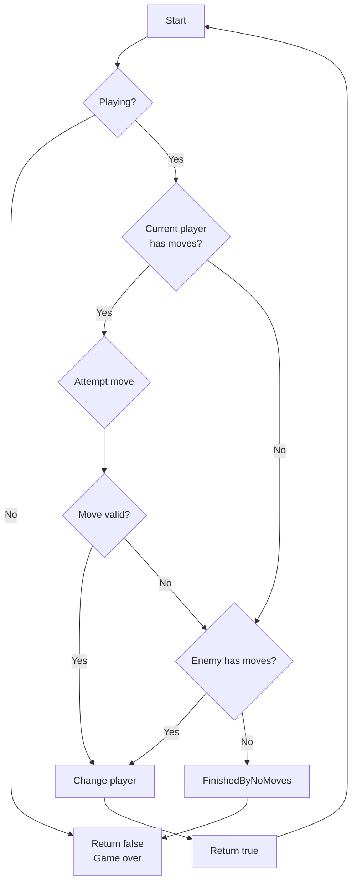

```
███████╗██╗                    ██████╗ ████████╗██╗  ██╗███████╗██╗     ██╗      ██████╗ 
██╔════╝██║                   ██╔═══██╗╚══██╔══╝██║  ██║██╔════╝██║     ██║     ██╔═══██╗
█████╗  ██║         █████╗    ██║   ██║   ██║   ███████║█████╗  ██║     ██║     ██║   ██║
██╔══╝  ██║         ╚════╝    ██║   ██║   ██║   ██╔══██║██╔══╝  ██║     ██║     ██║   ██║
██║     ███████╗              ╚██████╔╝   ██║   ██║  ██║███████╗███████╗███████╗╚██████╔╝
╚═╝     ╚══════╝               ╚═════╝    ╚═╝   ╚═╝  ╚═╝╚══════╝╚══════╝╚══════╝ ╚═════╝ 
```

My own implementation of Othello/Reversi board game.

Started developing to desktop but my code should be easy to bring to Android as well (via Compose Multiplatform).

## Game flow

This is the flow of the game:

