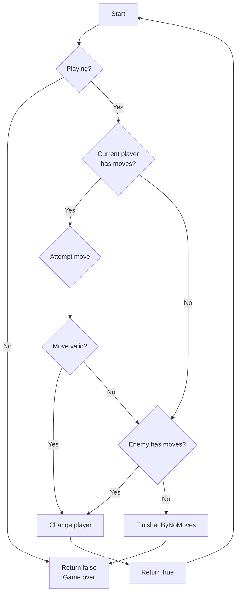
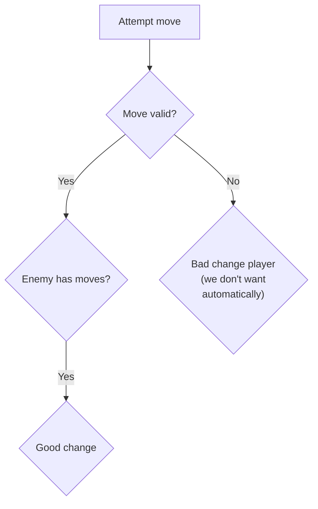

```
███████╗██╗                    ██████╗ ████████╗██╗  ██╗███████╗██╗     ██╗      ██████╗ 
██╔════╝██║                   ██╔═══██╗╚══██╔══╝██║  ██║██╔════╝██║     ██║     ██╔═══██╗
█████╗  ██║         █████╗    ██║   ██║   ██║   ███████║█████╗  ██║     ██║     ██║   ██║
██╔══╝  ██║         ╚════╝    ██║   ██║   ██║   ██╔══██║██╔══╝  ██║     ██║     ██║   ██║
██║     ███████╗              ╚██████╔╝   ██║   ██║  ██║███████╗███████╗███████╗╚██████╔╝
╚═╝     ╚══════╝               ╚═════╝    ╚═╝   ╚═╝  ╚═╝╚══════╝╚══════╝╚══════╝ ╚═════╝ 
```

My own implementation of Othello/Reversi board game.

Started developing to desktop but my code should be easy to bring to Android as well (via Compose Multiplatform).

## Game flow

This is the flow of the game:



We really expect that UI always send valid coords to avoid automatically skips current player if he "clicks" at a invalid coord, as described in this part:



## Project structure

This project is structured as a multi-module gradle project. Also, using this, we have the gradle plugin "Multiplatform", which help us keep a concise structure.
Knowing this, we are keeping the following modules (subprojects):
- `:core`: the root base business logic for the game. Contains tests;
- `:ui`: module that declares and defines all UI views/components/composables for the project. As this project is multiplatform, in this module we have multiple common and platform specific code of other platforms. Other modules can use this and just call the common entities from here;
- `:desktop`: contains a launcher that inflates the UI and starts the game in the Desktop platform;
- `:android`: contains a launcher that inflates the UI and starts the game in the Android platform.